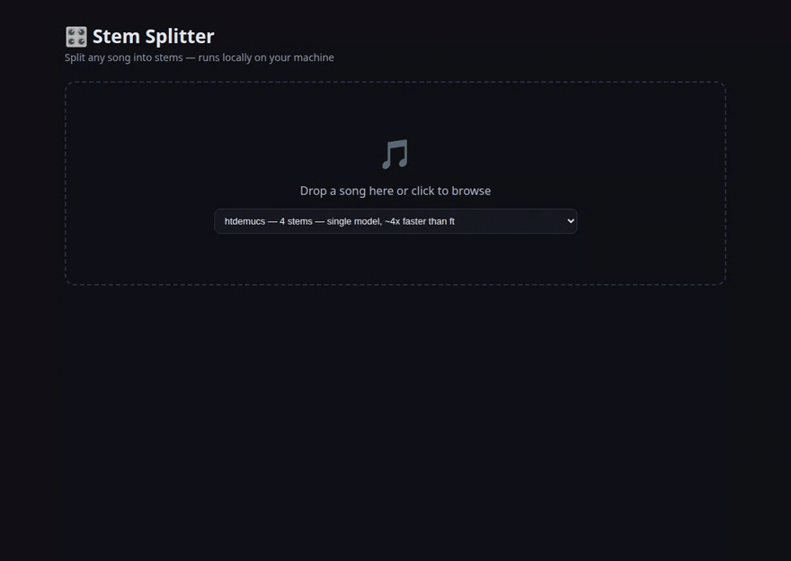

# 🎛️ Stem Splitter

Split any song into stems — vocals, drums, bass, guitar, piano — using
[Demucs v4](https://github.com/facebookresearch/demucs) (Meta's hybrid
transformer source-separation model), wrapped in a simple web UI.



*The stem mixer: solo the vocals, mute the drums, ride the bass fader, click a waveform to seek — all stems stay in sample-accurate sync.*

## Features

- 🎸 6-stem separation by default (vocals / drums / bass / guitar / piano / other) with `htdemucs_6s`
- 🎤 4-stem mode with `htdemucs_ft` for the highest-quality vocal/drum/bass isolation
- 🎚️ Web-based stem mixer: per-stem volume / mute / solo, synced waveforms, click-to-seek, per-stem download
- 🎼 Pitch shift (±6 semitones) and playback speed (0.5×–1.5×) — live, without stopping playback ([Signalsmith Stretch](https://github.com/Signalsmith-Audio/signalsmith-stretch))
- 🥁 Automatic tempo + beat detection (on the isolated drums) with a metronome click
- 🎹 Chord detection (on the drum-free mix) shown as a clickable timeline
- 🎤 Synced lyrics, transcribed by Whisper from the *isolated vocals* (far more accurate than on the full mix) — karaoke-style highlighting, click a line to jump there
- 🎼 Sheet music per stem: [basic-pitch](https://github.com/spotify/basic-pitch) transcribes the isolated stem to notes, quantized against the detected tempo and rendered in-browser ([OSMD](https://opensheetmusicdisplay.org/)) — with PDF / MIDI / MusicXML download. Approximate by nature, but a real head start for learning a part
- 💾 Export your adjusted mix as wav — rendered in the browser at the current pitch/speed
- 🔒 Runs fully locally — your audio never leaves your machine
- ⚡ Fast on any hardware: multi-GPU machines run the `htdemucs_ft` sub-models in parallel (~4 s for a 3-minute song); CPU-only machines get parallel segment processing and automatically lighter defaults (`htdemucs` + whisper `base`, ~30–60 s for a 3-minute song on a modern desktop CPU). Models preload at server startup (`STEM_PRELOAD=0` to disable), and every job reports per-stage timings (shown under the transport bar and in the API)

## Quickstart (Docker)

The easiest way to run it — no Python/Node setup:

```bash
git clone https://github.com/leekt0124/stem-splitter.git
cd stem-splitter
docker compose up --build      # then open http://localhost:8000
```

Separation runs on CPU by default (a few minutes per song). With an NVIDIA
GPU and [nvidia-container-toolkit](https://docs.nvidia.com/datacenter/cloud-native/container-toolkit/latest/install-guide.html),
uncomment the `deploy:` block in `docker-compose.yml` for seconds-per-song
separation. Model weights download on first use into a named volume, so
updates (`git pull && docker compose up --build`) never re-download them.

## Quickstart (local)

Requires Python ≥ 3.10, [ffmpeg](https://ffmpeg.org/) on your PATH, and Node ≥ 18 (only to build the mixer frontend).

```bash
git clone https://github.com/leekt0124/stem-splitter.git
cd stem-splitter
python -m venv .venv && source .venv/bin/activate
pip install -r requirements.txt
pip install --no-deps basic-pitch   # sheet music; --no-deps: its pins predate py3.13

# build the mixer frontend once
(cd frontend && npm install && npm run build)

uvicorn api:app --port 8000
```

Open http://localhost:8000, drop in a song, and mix.
Model weights (~300 MB–1 GB depending on the model) are downloaded
automatically on first use and cached under `~/.cache/torch`.

There is also a simpler Gradio UI (no Node needed): `python app.py` → http://localhost:7860.

### Accessing over the network

If you open the app from another machine via plain `http://<server-ip>:8000`,
browsers treat that as an insecure context and disable AudioWorklet, so the
**pitch/speed controls are greyed out** (everything else works). To get them
back, either tunnel the port so it's localhost on your machine:

```bash
ssh -L 8000:localhost:8000 user@server   # then open http://localhost:8000
```

or put the app behind HTTPS (e.g. a Caddy/nginx reverse proxy).

## REST API

The FastAPI server that powers the mixer is also usable directly:

```bash
# submit a job
curl -X POST localhost:8000/api/separate -F "file=@song.mp3" -F "model=htdemucs_ft"
# -> {"job_id": "9954a4b415d9"}

curl localhost:8000/api/jobs/9954a4b415d9            # poll: queued / running / done
curl -O localhost:8000/api/jobs/9954a4b415d9/stems/vocals   # download a stem
curl localhost:8000/api/jobs/9954a4b415d9/analysis   # tempo, beat times, chord timeline
curl localhost:8000/api/jobs/9954a4b415d9/lyrics     # Whisper transcript of the vocal stem
```

## How it works

```
frontend/ (React stem mixer)     app.py (Gradio UI)
   Web Audio GainNode per stem        │
        │ REST                        │
   api.py (FastAPI, async jobs) ──────┤
                                      │
                        separator/  (framework-independent core)
                             └── demucs  →  one wav per stem in output/<song>/<model>/
```

The mixer decodes each stem into an `AudioBuffer` and plays them through
per-stem `GainNode`s on one `AudioContext` clock, so solo/mute/volume are
instant and everything stays in sync.

## Roadmap

- [x] Gradio MVP: upload → separate → play/download stems
- [x] FastAPI backend (async jobs, stem download API)
- [x] React stem mixer: synchronized playback, solo/mute/volume, waveforms, seek
- [x] Export the adjusted mix as wav (rendered in-browser with OfflineAudioContext)
- [x] Pitch shift / time stretch (Signalsmith Stretch AudioWorklet)
- [x] Beat grid + metronome, chord detection (librosa on the separated stems)
- [x] Lyrics transcription (Whisper on the vocal stem), synced karaoke view
- [ ] Loop sections (A/B repeat) for practice
- [ ] Downbeat detection for a bar-aware metronome

## Acknowledgements

- [Demucs](https://github.com/facebookresearch/demucs) by Meta AI Research (MIT)
- Inspired by [Moises](https://moises.ai/)

## License

MIT — see [LICENSE](LICENSE).
